## Project Name: WheelsWater 

  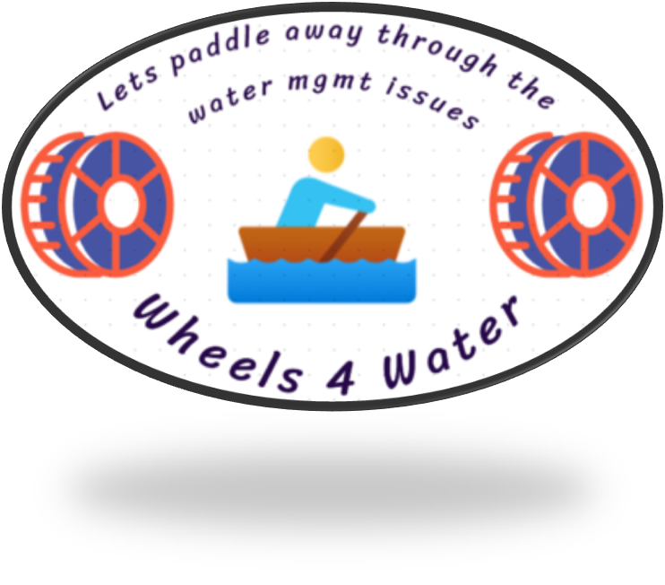

## Problem Statement
Are we neglecting the importance of water and not looking after the water management issues? The answer is **YES**. So, I have made a project which basically revolves around the **smart water management** concept. Obviously the water is not smart, the management technique is unique and out of the box. 

The project will mainly eliminate the water-tanks overflowing  problems so that annually we can save **25,00,00,00,000 litres of water**

> As of now there are only two viable solution are there for this problem, one being the **solenoid ball valve** while the other is **water overflow alarm system.**

## About the project

  

1. A Nodemcu based robot which will be deployed in order to inform the user.
2. By the help of ID3 Algorithm, the project predicts and thus helps the robot
3. Monitoring the smart device or keeping an eye on the stats, cloud is there to help you

## Previous Projects
1️⃣ All of the previous projects only focus on the very last end of the cycle ie the project only deals with the water tanks of our homes

2️⃣ The projects were almost passive. The whole computation would be done within the microprocessor and the end-user can’t get to know what is happening inside the code at the moment!

3️⃣ Less interactive projects. If one can provide some motion or life to the immobile projects then it will greatly enhance the chances of implementing the project in real life.

4️⃣ Very few of the projects use the concept of Machine Learning. Those who use the ML concepts are just using the pre-built easy structured graphs and anomaly detection things which actually don’t make much more sense!!

## How my project is unique?
1️⃣ Apart from the basic sensors, I have used many different sensors. Be it a **water flow sensor, solenoid valve, or an analog multiplexer IC (CD4051)**, all these sensors helped me to almost nullify the water wastage through the whole water supply chain. In this manner, I focused on the whole water supply chain.

2️⃣ At every instance of the project execution, the end-user will be updated and informed about each major workflow. The project will talk with the user. Thus making the project **active**.

3️⃣ In order to make this project more interactive, I dumped the old idea of integrating **IFTTT** or using the CLI. Even I have not used either the blynk application or the normal switches in my project. Instead of all this, I have provided four custom options to control the project which include a **dedicated website, NodeMCU based robot, customized cloud dashboard & voice control** (I have not used any drag and drop feature of Blynk or IFTTT applications)

**Now let's have a look at the components incorporated in the project**

  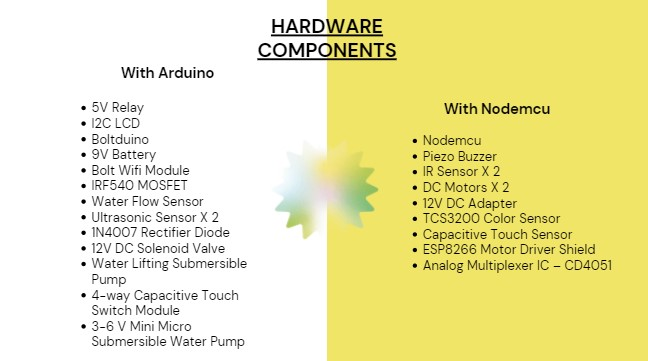 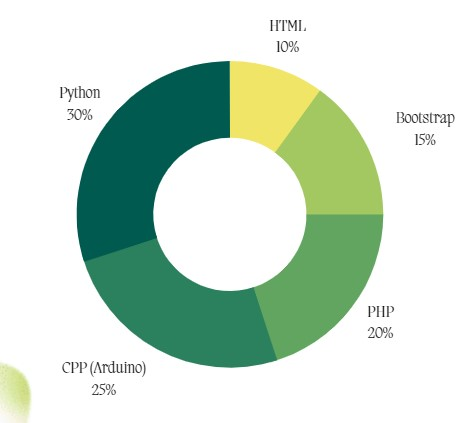
 

For controlling the **_microcontrollers_** I used Cpp and Python while for making the **_website_** I used HTML, CSS & Php.

## Website
Let's take a quick look 👀 at the website which I have made for this proejct

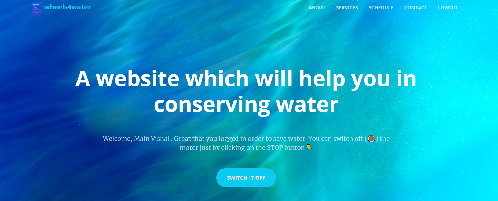
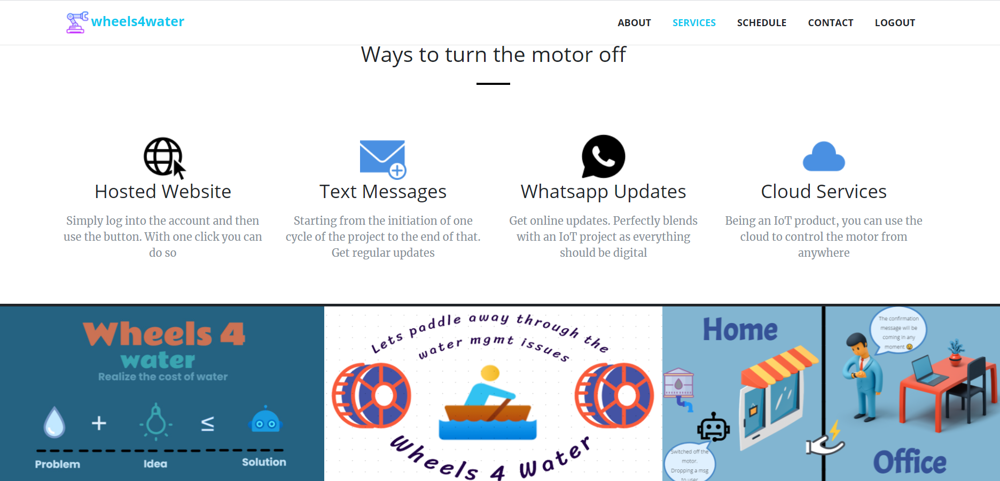

There are a lot of **beautifully-designed** sections in the website for the user. About section tells what are the utilities and softwares used in the project. Gallery section rightly reflects what the project is all about. **Schedule** section is a dynamic part where user can schedule the robot and inform him that for next couple of days, the user will not be at home. 

Also, the webiste greets the user with an email at two occasions: 
1. First, when the user registers. 
2. Second, when the user adds a new IoT device to control. At a time, user can only incorporate 2 smart devices with the website.

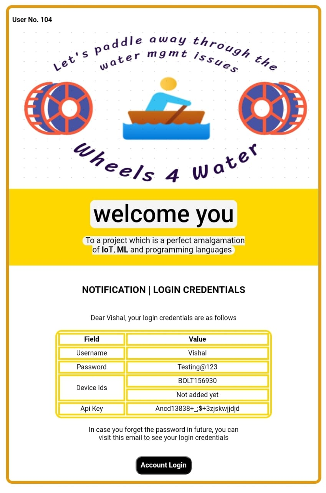

Another email template follows the same design code but only the content differs. I want to **emphasize** on the fact that the email template is structured by my own and are sent by the help of php script files. 

Hold on, there is more. Let's have a look at the **whatsapp messages** sent to the user during the course of the project.

  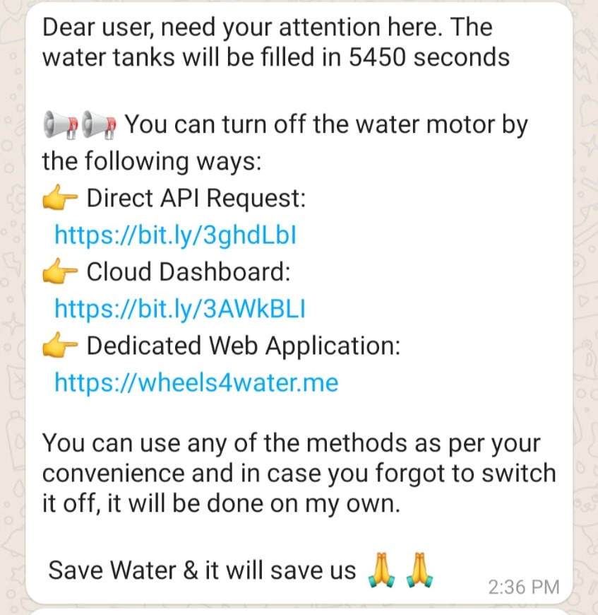

## Software & Online Services Used

  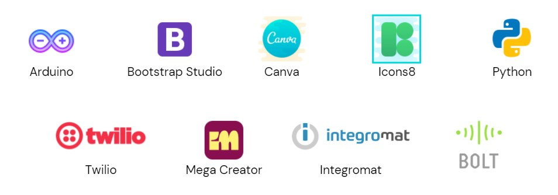

## Hardware Configurations

**_Arduino Setup (static one) followed by the Robot Setup (mobile one)_**

  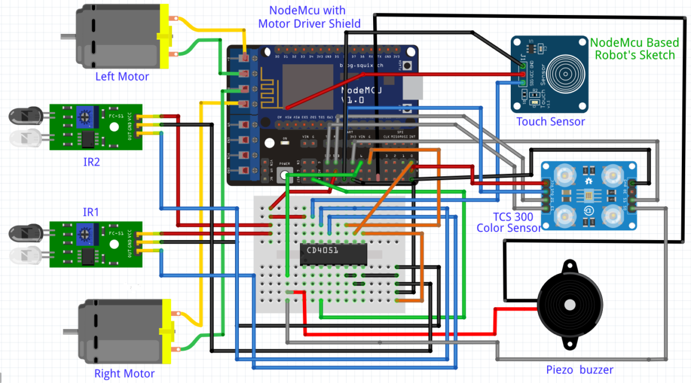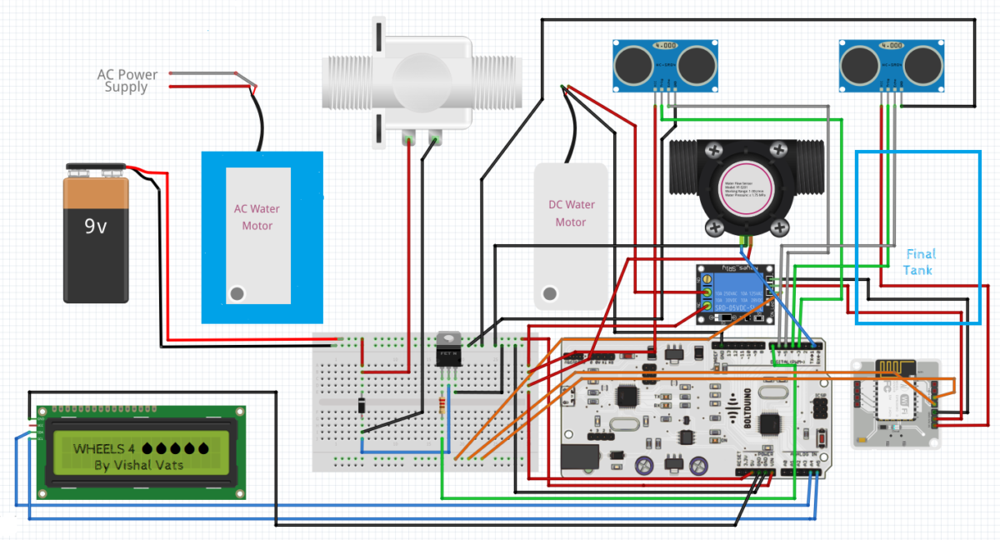

A total of **100 jumper wires and 30 electrical sensors** have been used to make the hardware part of this project. **Serial communication, collection of live data points, preparing a decision tree through Iterative Dichotomizer 3 algoritm, running Integromat webhooks, sending & retrieving sensors data, making the robot fetch them and work accordingly, calibration and sychronization of electrical sensors**, a lot is going on at the back end. It took a toal of **_2200 lines of code_** to make this project into a functionable project which is ready to serve the society & can easily manage its journey from being a **project to product**.

## Project Gallery

  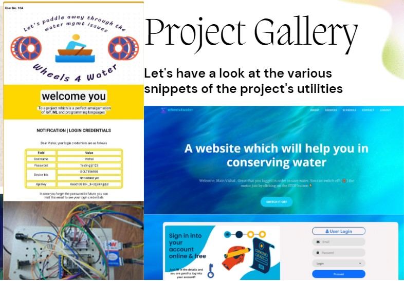 

## Important Links

<table align="center">
  <tr>
    <th>Platform</th>
    <th>Link</th>
  </tr>
  <tr>
    <td>Website</td>
    <td><a href="https://wheels4water.me">Click here</a></td>
  </tr>
  <tr>
    <td>Documentation & videos link</td>
    <!--<td><a href="https://www.hackster.io/vishalvats2000/water-saviours-let-s-paddle-away-through-water-mgmt-issues-6c0fb4">Click here</a></td>!-->
    <td><a href="https://youtu.be/XQHRkYjVgrg">Click here</a></td>
  </tr>
</table>

Check out the faqs.md file also where I have tried to answer some general questions which may arise in the reader's mind. I have used Twilio & GitHub so that I can make the project perform to the full extent.

<b>Note:</b> Please check the entire videos and documents as I have tried my best to make a project which can be useful to mankind and it is a unique project in its domain and uses many utilities.

